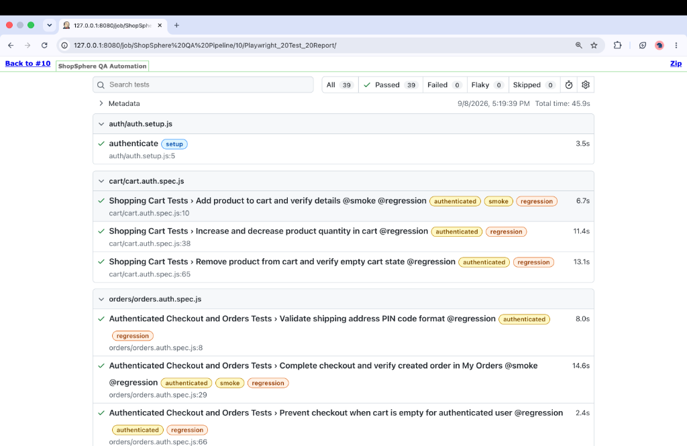

# ShopSphere QA Automation Framework

A production-grade, end-to-end quality assurance and test automation framework developed for the **ShopSphere** MERN stack e-commerce platform. This framework implements UI automation using **Playwright (JavaScript)** following the **Page Object Model (POM)** architectural pattern, API testing via **Postman and Newman**, and continuous integration and deployment with **Jenkins**.

---

## Overview

The **ShopSphere QA Automation Framework** provides comprehensive automated test coverage for core business workflows, security boundaries, and edge cases across the ShopSphere e-commerce application. 

Key architectural highlights:
* **UI Automation with Playwright**: Modern, fast, and reliable browser automation supporting isolated execution contexts and multi-worker parallelism.
* **Page Object Model (POM)**: Complete decoupling of page locators and operational methods from test logic for high maintainability.
* **Session Storage Authentication**: Fast, single-login authenticated state sharing via Playwright `storageState`, eliminating redundant login overhead.
* **API Validation via Postman & Newman**: Multi-endpoint API verification ensuring contract compliance, performance SLAs, and business logic integrity.
* **Continuous Integration with Jenkins**: Fully automated CI/CD pipeline executing tests on headless browsers, generating visual HTML reports, and archiving build artifacts.
* **Formal Defect Governance**: Detailed defect documentation covering reproduction steps, root cause analysis, and suggested developer remediations.

---

## Application Under Test

* **Application Name**: ShopSphere E-Commerce Hub
* **Architecture**: MERN Stack (MongoDB, Express.js, React, Node.js)
* **Frontend Web Application**: [https://shop-sphere-mern-ecommerce.vercel.app](https://shop-sphere-mern-ecommerce.vercel.app)
* **Application Scope**: User authentication, product catalog search and filtering, product details, quantity management, shopping cart operations, wishlist management, coupon application, and checkout/order processing.

---

## Tech Stack

| Category | Technology |
|---|---|
| Application | MERN Stack (MongoDB, Express.js, React, Node.js) |
| UI Automation | Playwright |
| API Testing | Postman |
| API CLI Execution | Newman |
| CI/CD | Jenkins |
| Language | JavaScript (ES6+) |
| Runtime | Node.js |
| Design Pattern | Page Object Model (POM) |
| Reporting | Playwright HTML Report |
| Version Control | Git / GitHub |

---

## Testing Strategy

The framework implements a comprehensive test strategy balancing UI end-to-end automation with headless API contract validation:

```text
+-------------------------------------------------------------------+
|                     ShopSphere Testing Strategy                   |
+-------------------------------------------------------------------+
                                  │
         ┌────────────────────────┴────────────────────────┐
         ▼                                                 ▼
+───────────────────────────+                     +───────────────────────────+
|    UI Automation (E2E)    |                     |        API Testing        |
|        (Playwright)       |                     |     (Postman / Newman)    |
+─────────────┬─────────────+                     +─────────────┬─────────────+
              │                                                 │
     ┌────────┴────────┐                                        │
     ▼                 ▼                                        │
+─────────────+ +─────────────+                                 │
| Setup State | | Auth State  |                                 │
| (user.json) | | Reusability |                                 │
+──────┬──────+ +──────┬──────+                                 │
       └───────┬───────┘                                        │
               ▼                                                ▼
+─────────────────────────────────────────────────────────────────────+
|               Continuous Integration Pipeline (Jenkins)             |
+──────────────────────────────────┬──────────────────────────────────+
                                   │
                                   ▼
+─────────────────────────────────────────────────────────────────────+
|             Test Artifact Archival & Playwright HTML Report         |
+─────────────────────────────────────────────────────────────────────+
```

---

## Test Coverage

### Authentication
* **Login Workflows**:
  * Valid credential login with session persistence.
  * Validation error on non-registered/invalid email address.
  * Validation error on incorrect password.
  * Client-side validation when submitting with empty email field.
  * Client-side validation when submitting with empty password field.
  * Successful user session logout and state clearance.
* **Registration Workflows**:
  * Successful registration with new valid credentials.
  * Duplicate account prevention when registering with an existing email.
  * Email format validation for invalid email syntax.
  * Password strength validation against weak passwords.
  * Required field validation for missing Name, missing Email, and missing Password.
* **Password Recovery**:
  * Password recovery request initiation with valid user email.
  * Error validation for non-existent email address.
  * Format validation for invalid email inputs.
  * Boundary validation for empty email submissions.

### Products
* **Product Details View**:
  * Seamless navigation from product catalog to individual product details page.
  * Verification of product name, current selling price, original price, and discount percentage badge.
  * Customer review score rating and total review counts validation.
  * Available promotional offers, product highlights, specifications, and customer review sections.
* **Quantity Controls & Boundary Testing**:
  * Default product selection quantity verification (default: 1).
  * Incrementing quantity via `+` control with dynamic UI counter updates.
  * Decrementing quantity via `-` control with dynamic UI counter updates.
  * **Boundary check**: Ensuring quantity cannot be decreased below minimum threshold (1).

### Search & Filtering
* **Keyword Search**: Keyword query submission verifying exact and related product matches.
* **Empty State Handling**: Searching for non-existent keywords displays the appropriate empty state banner and reset filter action.
* **Category Filtering**: Filtering products by category (e.g., Shoes) displays matching category products.
* **Filter Reset**: "Clear All Filters" restores full catalog inventory.
* **Price Sorting**: Ascending price sorting ("Price: Low to High") verifying numeric price ordering across all items.

### Wishlist
* **Access Control**: Unauthenticated access prevention (modal prompt requesting user login).
* **Authenticated Management**: Adding products to wishlist from product details and updating UI icon state.
* **Wishlist Page State**: Verifying added items render on the dedicated Wishlist page.
* **Removal**: Removing products from the Wishlist and verifying real-time item detachment.

### Cart
* **Item Addition**: Adding in-stock products to cart with real-time UI notification.
* **Detail Verification**: Validating item name, unit price, quantity counter, and overall total price.
* **Quantity Adjustments**: Incrementing and decrementing cart quantities with live subtotal calculation.
* **Item Deletion**: Removing items from the cart and confirming transition to the empty cart state with navigation back to shopping.

### Checkout & Orders
* **Route Protection**: Unauthenticated checkout attempt redirects to `/login`.
* **Authenticated Checkout**: Step-by-step checkout flow from shipping address to payment confirmation.
* **Field Validation**: Shipping postal/PIN code format verification.
* **Order Creation & Verification**: Order placement verification followed by order confirmation in the "My Orders" history.
* **Cart Boundary Check**: Empty cart checkout prevention.

---

## API Testing

The framework incorporates comprehensive backend API testing using **Postman** collections executed headlessly via the **Newman** command-line runner:

* **Endpoint Coverage**:
  * **Authentication API**: Login, registration, token generation, and authorization headers.
  * **Product API**: Catalog retrieval, single product query, and search endpoints.
  * **Wishlist API**: Item addition, retrieval, and deletion payloads.
  * **Order API**: Order checkout payload validation, order placement, and history retrieval.
  * **Coupon API**: Coupon code validation and discount calculation.
* **Validation Standards**:
  * **HTTP Status Code Verification**: Confirming `200 OK`, `201 Created`, `400 Bad Request`, `401 Unauthorized`, `404 Not Found`.
  * **Response Body & Schema Validation**: Verifying data types, expected JSON keys, arrays, and nested object integrity.
  * **Performance & SLA Validation**: Ensuring API response times fall within acceptable thresholds.
  * **Environment Isolation**: Managing environment variables (`baseUrl`, auth tokens, user credentials) across staging and production targets.
  * **CLI Execution**: Headless test runs integrated via Newman scripts.

---

## Playwright UI Automation

* **Asynchronous Auto-Waiting**: Relies on Playwright's built-in auto-waiting for actionability (visible, enabled, stable) instead of fragile arbitrary sleep statements.
* **Web-First Assertions**: Employs auto-retrying assertions (`expect(locator).toBeVisible()`, `expect(locator).toHaveText()`) to handle single-page application (SPA) rendering seamlessly.
* **Headless Chromium Execution**: Executes against Chromium browser instances configured for high-throughput headless runs.
* **Failure Artifacts**: Automatically captures execution traces, screenshots, and videos upon first failure for post-mortem analysis.

---

## Page Object Model

The framework strictly adheres to the **Page Object Model (POM)** pattern. Test scripts contain only high-level user actions and assertions, while all selectors and page-specific interactions are encapsulated in dedicated page classes:

* **`ProductPage.js`**:
  * Product card selectors and navigation.
  * Product specifications, pricing, rating, and offer locators.
  * Quantity increment/decrement interactions.
  * Wishlist toggle and Add-to-Cart operational methods.
* **`CartPage.js`**:
  * Cart navigation and item lookup by product name.
  * Dynamic item price and quantity extraction.
  * Quantity adjustment and item removal controls.
  * Checkout initiation and empty cart verification.
* **`WishlistPage.js`**:
  * Wishlist page navigation and heading assertions.
  * Dynamic item identification and visibility verification.
  * Item removal action and direct cart transfer.

---

## Authentication & Test Setup

To avoid executing redundant login steps across every authenticated test, the suite leverages Playwright's **Project Dependencies** and **Storage State** architecture:

```text
[ Project: setup ]
  auth.setup.js  ---> Logs in via UI/API ---> Saves session to: playwright/.auth/user.json
                                                        │
                      ┌─────────────────────────────────┴─────────────────────────────────┐
                      ▼                                                                   ▼
         [ Project: authenticated ]                                          [ Project: unauthenticated ]
         - Uses: playwright/.auth/user.json                                  - Uses: Clean browser context
         - Runs: *.auth.spec.js                                              - Runs: *.spec.js
         - Dependent on 'setup'                                              - No auth dependencies
```

1. **`setup`**: Executes `auth.setup.js`, performs a single authenticated login, and stores cookies/local storage in `playwright/.auth/user.json`.
2. **`authenticated`**: Automatically loads `user.json` storage state. Executes tests requiring an active user session (Cart, Wishlist, Checkout).
3. **`unauthenticated`**: Runs in an isolated, clean browser context. Tests public features, guest navigation, and route security redirects.

---

## Negative Testing

The test suite puts significant emphasis on negative and boundary validations to guarantee system resilience:
* Invalid email formats and non-existent accounts during authentication.
* Weak password submissions during registration.
* Boundary tests on quantity decrements below `1`.
* Form submission attempts with missing mandatory fields (name, email, password).
* Route protection verifying unauthorized users cannot access authenticated views (`/checkout`).
* Empty cart protection preventing checkout submission without items.

---

## Defect Reporting

During test development and exploratory testing, defects were identified and documented in formal defect reports:

* **`defects/ShopSphere_Bug_Report.md`**
* **`defects/ShopSphere_UI_Bug_Report.md`**

### Documented Defects:
1. **Registration Email Validation**: Invalid email formats accepted during registration without proper syntax enforcement.
2. **Registration Password Policy**: Weak passwords accepted during registration without enforcing complexity criteria.
3. **Coupon API Calculation**: Coupon API returned `null` for `discountAmount` when applying a valid percentage-based discount coupon.
4. **Wishlist API State Inconsistency**: The Add-to-Wishlist endpoint returned a successful response, but subsequent Get-Wishlist queries did not immediately reflect the newly added product.

---

## Jenkins CI/CD

The automated test suite is integrated into a continuous delivery pipeline orchestrated by **Jenkins**:

```text
GitHub Push / Trigger
          ↓
   Jenkins Checkout
          ↓
  Verify Node & npm
          ↓
Install Dependencies (npm ci)
          ↓
Install Playwright Browsers
          ↓
Run 39 Playwright Tests
          ↓
 Generate HTML Report
          ↓
   Archive Artifacts
          ↓
 Publish HTML Report
```

### Pipeline Execution Status:
* **Total Executed**: 39
* **Passed**: 39
* **Failed**: 0
* **Execution Status**: SUCCESS

---

## Playwright HTML Report

Playwright generates an interactive HTML report containing step-by-step execution traces, screenshots, video recordings, and timing metrics:



---

## Test Execution Results

| Result | Count |
|---|---:|
| Total Tests | 39 |
| Passed | 39 |
| Failed | 0 |
| Execution Time | ~45.9 seconds |

> **Latest Jenkins execution: 39/39 tests passed successfully.**

---

## Project Structure

```text
shopsphere-qa-automation/
│
├── playwright/
│   ├── pages/
│   │   ├── ProductPage.js
│   │   ├── CartPage.js
│   │   └── WishlistPage.js
│   │
│   ├── tests/
│   │   ├── auth/
│   │   ├── products/
│   │   ├── cart/
│   │   ├── wishlist/
│   │   ├── orders/
│   │   └── navigation.spec.js
│   │
│   ├── playwright.config.js
│   ├── package.json
│   └── playwright/
│       └── .auth/
│
├── defects/
│   ├── ShopSphere_Bug_Report.md
│   └── ShopSphere_UI_Bug_Report.md
│
└── README.md
```

---

## How to Run Locally

### 1. Prerequisites
* **Node.js**: Version 18.x or 20.x installed.
* **Git**: Installed and configured.

### 2. Setup
Navigate to the Playwright directory and install dependencies:
```bash
cd playwright
npm ci
npx playwright install --with-deps chromium
```

### 3. Environment Configuration
Create a `.env` file in the `playwright/` directory with test credentials:
```env
USER_EMAIL=your_test_user@example.com
USER_PASSWORD=your_secure_password
```

### 4. Execute Tests
Run the entire Playwright test suite:
```bash
npm test
```

---

## Useful Playwright Commands

* **Run a specific test file**:
  ```bash
  npx playwright test tests/products/products.spec.js
  ```

* **Run tests in headed browser mode**:
  ```bash
  npx playwright test --headed
  ```

* **Run a specific test by title**:
  ```bash
  npx playwright test --grep "Verify product details"
  ```

* **Run tests filtered by project**:
  ```bash
  npx playwright test --project=authenticated
  npx playwright test --project=unauthenticated
  ```

* **View the Playwright HTML test report**:
  ```bash
  npx playwright show-report
  ```

---

## Project Highlights

* **39 Automated Playwright Tests**: Full functional test coverage across critical user paths.
* **39/39 Latest Jenkins Execution Passed**: Reliable, green CI/CD build execution with zero test failures.
* **UI Automation**: Resilient browser automation with auto-waiting, role-based locators, and web-first assertions.
* **API Testing with Postman/Newman**: API verification covering status codes, response schemas, and performance SLAs.
* **Page Object Model**: Clean, maintainable architecture separating selectors and actions from test assertions.
* **Authenticated and Unauthenticated Test Execution**: Fast session reuse with Playwright `storageState`.
* **Smoke Testing**: Tagged core user journeys for rapid build smoke verification.
* **Regression Testing**: Exhaustive functional validation covering all catalog, checkout, and account modules.
* **Negative & Boundary Testing**: Rigorous validation of invalid inputs, format constraints, and access control.
* **End-to-End Testing**: Real-world customer journeys from product discovery through checkout confirmation.
* **CI/CD with Jenkins**: Automated pipeline executing builds, generating reports, and archiving artifacts.
* **Automated HTML Reporting**: Interactive test reports with failure traces, videos, and step timings.
* **Defect Documentation**: Structured defect documentation with root-cause investigations and developer recommendations.

---

## Conclusion

The **ShopSphere QA Automation Framework** demonstrates modern software test engineering best practices. By combining the speed and reliability of **Playwright**, clean **Page Object Model** design, session-reuse authentication, headless **Postman/Newman** API validation, and an automated **Jenkins CI/CD** pipeline, this framework ensures high test reliability, short feedback loops, and maintainable quality standards for the ShopSphere e-commerce application.
